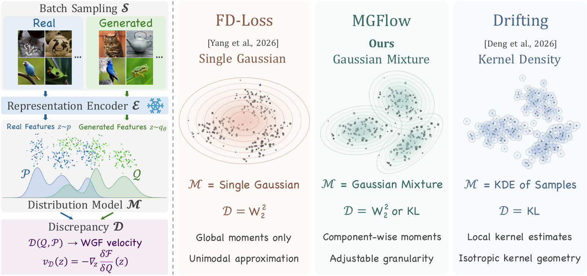

# MGFlow

[Unifying Distributional Training for One-Step Visual Generation](https://arxiv.org/abs/2609.35763)

[Paper](https://arxiv.org/abs/2609.35763) ·
[Project page](https://shihaoyang0423.github.io/MGFlow-website/) ·
[**Try the demo**](https://huggingface.co/spaces/shy0423/mgflow) ·
[Models and reference assets](https://huggingface.co/shy0423/MGFlow) ·
[T2I reference images](https://huggingface.co/datasets/shy0423/MGFlow-T2I)

MGFlow (Mixture Gradient Flow) post-trains one-step visual generators by matching
real and generated features in frozen representation spaces. Our framework connects
distributional objectives to per-sample updates through Wasserstein gradient flow.
Gaussian mixtures provide componentwise statistics for Wasserstein or KL matching;
mass-constrained assignments and paired updates keep generated and reference
components aligned.




*One-step samples from FLUX.2 [klein] 4B post-trained with MGFlow.*

## What is included

This repository supports training, sampling, evaluation, feature extraction, and reference
distribution fitting and validation.

| Task | Model | Method | Gaussian components |
| --- | --- | --- | --- |
| ImageNet 256×256 | JiT and pMF, B/L/H | MGFlow-W2 | 1 + 4 |
| ImageNet 256×256 | JiT and pMF, B/L/H | MGFlow-KL | 1 + 4 + 16 |
| Text-to-image | FLUX.2 [klein] 4B | MGFlow-KL, image-only or joint image–text | 1 + 4 |

Released checkpoints, frozen encoders, reference distributions, and evaluation
assets are available on [Hugging Face](https://huggingface.co/shy0423/MGFlow).
The [T2I dataset](https://huggingface.co/datasets/shy0423/MGFlow-T2I) contains the
COCO and GenEval reference images and their prompts.

## Installation

Use Python 3.11 with CUDA-enabled PyTorch. From the repository root:

```bash
pip install -e .
```

The CUDA 12.4 dependency versions are pinned in `requirements-cuda.txt`:

```bash
pip install -r requirements-cuda.txt
pip install -e .
```

For text-to-image training and sampling:

```bash
pip install -e '.[t2i]'
```

For evaluation, also install `.[evaluation]`. GenEval uses its official detector
environment, as described below.

If NCCL fails while initializing NVLS, set `NCCL_NVLS_ENABLE=0`.

## Assets

Download pretrained models, encoders, reference distributions, and evaluation assets:

```bash
mgflow download --output assets
```

To also download the post-trained models:

```bash
mgflow download --output assets --post-trained
```

The download preserves the Hugging Face directory layout. Encoders are extracted
into `assets/Encoders`; the supplied configurations use these paths.
Reference NPZ files contain `pi`, `mu`, and `sigma`. Training checkpoints contain
model weights, optimizer states, distribution statistics, and training progress.
The released model weights can also be loaded directly.

## Sampling

### ImageNet

```bash
mgflow sample --model JiT-B \
  --checkpoint assets/Checkpoints/ImageNet/Post-trained/JiT-B_KL-k1+4+16.pth \
  --count 64 --output runs/samples
```

Samples are written to a temporary file and published as `images.npy` only after
sampling completes. Use an empty output directory. To use another released model,
change both `--model` and `--checkpoint`.

### Text-to-image

```bash
mgflow sample --model black-forest-labs/FLUX.2-klein-4B \
  --checkpoint assets/Checkpoints/T2I/FLUX2-klein-4B_COCO-joint.pth \
  --prompts prompts.json --output runs/t2i-samples
```

`prompts.json` is a JSON list of prompt strings. Samples are saved as 512×512 PNGs.
FLUX weights are loaded through Diffusers; accept the access terms on the
[model page](https://huggingface.co/black-forest-labs/FLUX.2-klein-4B) if required.

## Training

### ImageNet

The supplied configurations use JiT-B:

```bash
torchrun --standalone --nproc-per-node=8 -m mgflow.cli train configs/imagenet-w2.toml
torchrun --standalone --nproc-per-node=8 -m mgflow.cli train configs/imagenet-kl.toml
```

For another JiT or pMF backbone, set its name and initialization checkpoint:

```bash
torchrun --standalone --nproc-per-node=8 -m mgflow.cli train configs/imagenet-kl.toml \
  --set 'model="pMF-H"' \
  --set 'initial_weights="assets/Checkpoints/ImageNet/Base/pMF-H.pth"' \
  --set 'output="runs/pmf-h-kl"'
```

### Text-to-image

Prepare the reference prompts and text features:

```bash
mgflow download-data --output assets/T2I
mgflow encode-text --prompts assets/T2I/metadata.jsonl --output assets/T2I/text.npy
```

Run joint image–text or image-only matching:

```bash
torchrun --standalone --nproc-per-node=8 -m mgflow.cli train configs/t2i-joint.toml
torchrun --standalone --nproc-per-node=8 -m mgflow.cli train configs/t2i-image.toml
```

Both configurations sample prompts from the released reference dataset. Joint
matching uses normalized SigLIP2 text features in the same image-ID order.

`micro_batch` and `encoder_micro_batch` control generation and encoder microbatch
sizes. Compilation, activation checkpointing, and optimizer sharding are configured
with `compile`, `activation_checkpointing`, and `zero_optimizer`.
Use a separate output directory for each run.

To resume an interrupted run with its optimizer, distribution statistics, and
random states:

```bash
torchrun --standalone --nproc-per-node=8 -m mgflow.cli train configs/imagenet-kl.toml \
  --resume runs/jit-b-kl/step_0012500.pth
```

Each checkpoint is a single `.pth` file that can be used for sampling or complete
resume. Keep the original configuration and process count. Passing a run directory
to `--resume` selects its latest checkpoint. To resume an older checkpoint, use a
new output directory; existing checkpoints are never overwritten.

The component combinations are fixed: ImageNet KL uses 1 + 4 + 16;
ImageNet W2 and text-to-image KL use 1 + 4.

The four supplied recipes are also available by name after installing a wheel,
for example `mgflow train imagenet-kl`.

## Evaluation

### ImageNet

Generate 50,000 class-balanced images and compute FID, IS, FDr⁶, and FDr³:

```bash
mgflow sample --model JiT-B \
  --checkpoint assets/Checkpoints/ImageNet/Post-trained/JiT-B_KL-k1+4+16.pth \
  --count 50000 --output runs/imagenet-samples
torchrun --standalone --nproc-per-node=8 -m mgflow.cli evaluate-imagenet \
  --images runs/imagenet-samples/images.npy --output runs/imagenet-metrics.json
```

Evaluation uses the released statistics and six frozen encoders. FDr³ uses
ConvNeXt, DINOv2-CLS, and CLIP-CLS; FDr⁶ additionally includes Inception, MAE,
and SigLIP. Both are means of per-encoder FD normalized by its real-image
validation FD. A directory of image files is also accepted by `--images`.

### Text-to-image

Get the [GenEval](https://github.com/djghosh13/geneval) prompts and the
[Pick-a-Pic evaluation prompts](https://github.com/vita-epfl/RDM/blob/main/assets/pickapic_test_prompts.jsonl):

```bash
git clone https://github.com/djghosh13/geneval.git evaluation/geneval
curl -L https://raw.githubusercontent.com/vita-epfl/RDM/main/assets/pickapic_test_prompts.jsonl \
  -o evaluation/pickapic_test_prompts.jsonl
```

Generate four images per GenEval prompt and one image per Pick-a-Pic prompt:

```bash
torchrun --standalone --nproc-per-node=8 -m mgflow.cli sample-geneval \
  --checkpoint assets/Checkpoints/T2I/FLUX2-klein-4B_COCO-joint.pth \
  --prompts evaluation/geneval/prompts/evaluation_metadata.jsonl \
  --output runs/geneval-samples
torchrun --standalone --nproc-per-node=8 -m mgflow.cli sample-pickscore \
  --checkpoint assets/Checkpoints/T2I/FLUX2-klein-4B_COCO-joint.pth \
  --prompts evaluation/pickapic_test_prompts.jsonl --output runs/pickscore-samples
```

Install GenEval's detector dependencies and download its detector weights using
the [official instructions](https://github.com/djghosh13/geneval#evaluation).
Then evaluate both sets:

```bash
mgflow evaluate-t2i --output runs/t2i-metrics.json \
  --geneval-images runs/geneval-samples --geneval-repo evaluation/geneval \
  --geneval-models /path/to/geneval-detector-weights \
  --geneval-python /path/to/geneval-environment/bin/python \
  --pickscore-images runs/pickscore-samples \
  --pickscore-prompts evaluation/pickapic_test_prompts.jsonl
```

GenEval reports each category and their mean. PickScore reports the mean raw
image–text score on the 499 evaluation prompts, not pairwise preference
probabilities. Either benchmark can also be evaluated on its own by omitting
the other benchmark's arguments. Detector configurations can be supplied with
`--geneval-config` and `--geneval-detector` when required by the GenEval environment.

## Reference fitting

Training uses the released references by default. To fit new references, extract
features with the same encoders and run the commands below.

<details>
<summary>ImageNet: K=1, 4, and 16</summary>

```bash
mgflow encode-images --images /path/to/imagenet/train --output features/imagenet
for encoder in SigLIP MAE Inception; do
  mgflow fit "features/imagenet/$encoder.npy" --encoder "$encoder" \
    --components 1 4 16 --output references/imagenet
done
```

Images are center-cropped to 256×256 before encoding. The encoders use the weights
extracted by `mgflow download`.

</details>

<details>
<summary>Text-to-image: K=1 and 4</summary>

Download the reference images. Prepare `assets/T2I/text.npy` with `mgflow encode-text`
as above if it does not already exist.

```bash
mgflow download-data --output assets/T2I --images
mgflow encode-images --config configs/t2i-image.toml \
  --images assets/T2I --output features/t2i-image
mgflow encode-images --config configs/t2i-joint.toml \
  --images assets/T2I --output features/t2i-joint
for variant in image joint; do
  for encoder in SigLIP MAE Inception; do
    mgflow fit "features/t2i-$variant/$encoder.npy" --domain t2i --encoder "$encoder" \
      --components 1 4 --output "references/t2i-$variant"
  done
done
```

Images and prompts follow the dataset's image IDs. Joint features concatenate the
image and scaled text embeddings, retaining the image–text cross-covariance.

</details>

K=1 computes the empirical mean and covariance in one pass, without clustering or
EM. K=4/16 use k-means++ initialization and full-data EM.

Validate a reference:

```bash
mgflow check-reference references/imagenet/SigLIP_K1.npz
mgflow check-reference references/imagenet/SigLIP_K4.npz \
  --features features/imagenet/SigLIP.npy
```

For K>1, validation performs one further EM update and checks the changes in
component weights, means, and covariances. A nonconverged fit returns a nonzero
exit status. To train with a new reference, set `reference` to its directory:

```bash
torchrun --standalone --nproc-per-node=8 -m mgflow.cli train configs/imagenet-kl.toml \
  --set 'reference="references/imagenet"' --set 'output="runs/new-reference-kl"'
```

## License

The code is released under the [MIT license](LICENSE). Third-party notices are
listed in [THIRD_PARTY.md](THIRD_PARTY.md). Model weights and datasets retain their
respective licenses.

## Citation

```bibtex
@article{zhang2026mgflow,
  title={Unifying Distributional Training for One-Step Visual Generation},
  author={Zhang, Chi and Shi, Haoyang and Liu, Yueyi and An, Ruichuan and Zhou, Junkang and Li, Chang and Lu, Xiuyuan and Zhang, Yichi and Wang, Bo and Wu, Yuhang and Cui, Sen and Liu, Miao},
  journal={arXiv preprint arXiv:2609.35763},
  year={2026}
}
```
